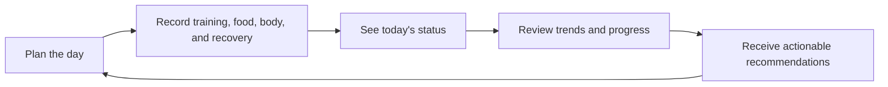

# Project99 Product Roadmap

Project99 will become a premium, mobile-first personal fitness operating system: one place to decide what to do today, record what happened, understand progress, identify obstacles, and improve over time.

The roadmap deliberately builds reliable tracking before recommendations, engagement mechanics, community, or AI.

## 1. Product vision

Project99 should answer four questions every day:

1. What should I do today?
2. How am I progressing?
3. What is holding me back?
4. What should I improve next?

The product is initially optimized for its owner’s daily use, while its architecture, security, and data ownership remain suitable for an eventual multi-user SaaS product.

### Core product loop

The Daily Log is the dated source of truth connecting these systems. Workout sessions, foods, templates, goals, and other reusable definitions remain separate entities and are referenced by the Daily Log where appropriate.

---

## 2. Roadmap overview

| Stage | Product outcome | Main capabilities |
|---|---|---|
| Now: Foundation verification | The existing authenticated flow works reliably with real Firebase data | Auth QA, Daily Log QA, security tests, deployment verification |
| Phase 1A: Daily operating system | The user can manage a complete day from one coherent experience | Daily Log, dashboard, goals, navigation, PWA polish |
| Phase 1B: Workout engine | The app becomes excellent for recording real gym sessions | Exercises, templates, sets, RPE, history, PRs, timers |
| Phase 1C: Nutrition system | Food intake can be logged without another tracking app | Food database, meals, servings, favourites, daily totals |
| Phase 1D: Measurements and progress | Physical progress becomes visible beyond scale weight | Measurements, photos, comparisons, trend views |
| Phase 1E: Recovery and cardio | Training readiness and non-lifting activity are represented | Sleep, mood, soreness, energy, steps, cardio sessions |
| Phase 1 release | Project99 is a complete personal fitness tracker | Unified dashboard, history, settings, accessibility, reliability |
| Phase 2: Insights | Raw tracking becomes useful guidance | Analytics, weekly reviews, correlations, deterministic recommendations |
| Phase 2B: AI coaching | The app can explain and personalize insights | Carefully scoped LLM summaries and coaching |
| Phase 3: Engagement | Consistency becomes rewarding without becoming distracting | Improved streaks, achievements, XP, levels, challenges, themes |
| Phase 4: Community | Users can involve trusted people in their progress | Friends, coaches, accountability, shared challenges |
| Later platform expansion | Proven workflows gain broader reach | Wearables, health platforms, notifications, native wrapper, billing |

---

# Phase 0 — Finish and verify the foundation

## Objective

Turn the existing implementation into a verified, production-ready baseline before adding another major system.

## Status as of 2026-08-07

Phase 0 implementation, automated verification, Firestore Security Rules
verification, production build verification, and public production reachability
are complete. See `docs/project/PHASE_0_VERIFICATION.md` for the verification
record.

Formal Phase 0 exit still requires owner-run runtime QA for authenticated Chrome
and Safari flows, session restoration, cross-device sync, conflict handling,
failed-save behavior, phone and desktop acceptance, installed iOS PWA behavior,
production Firestore writes, and Sentry delivery. These checks require user
credentials, hosting configuration, or a physical installed PWA and are not
application-code blockers for continuing Phase 1A.

## Current baseline

Already implemented or substantially implemented:

- Next.js mobile-first PWA foundation
- Google Authentication
- Authenticated dashboard routing
- User-owned Firestore document structure
- Initial dashboard and settings
- Date-addressable Daily Log
- Nutrition totals, weight, sleep, water, activity status, recovery, steps, and notes
- Mobile bottom navigation and desktop sidebar
- Firestore ownership and Daily Log validation rules
- Lint, typecheck, and production build checks

All prior feature and fix branches were reviewed and squash-merged to `main` as of 2026-07-31; no unmerged implementation work remains on branches.

## Remaining work

- Test Google sign-in in Chrome and Safari on the assigned production domain.
- Verify session restoration after closing and reopening the browser.
- Verify sign-out and authentication-loss behavior.
- Create, edit, refresh, and restore Daily Logs using real Firestore in
  production.
- Verify cross-device synchronization.
- Test remote-update conflicts.
- Test failed-save behavior.
- Complete phone and desktop acceptance testing.
- Complete installed iOS PWA sign-in, session restoration, and icon rendering
  checks.
- Configure Sentry in production and confirm a controlled test event is
  delivered.

## Why this comes first

Every future feature depends on authentication, ownership, dates, synchronization, and Daily Log persistence. Problems here would multiply across workouts, nutrition, photos, and analytics.

## Exit criteria

- Real authenticated workflow passes in Chrome and Safari.
- Saved data survives refresh and appears on another signed-in device.
- Cross-user access is proven to be denied.
- Mobile and desktop acceptance checks pass.
- Lint, typecheck, build, and security tests pass.
- Relevant pull requests are reviewed and merged.

---

# Phase 1A — Daily operating system

## Objective

Make Project99 useful every day before it becomes feature-heavy.

## Features

### Daily Log hardening

- Today and past-date editing
- Clear saved, unsaved, loading, empty, offline, and error states
- Protection against silently discarding unsaved changes
- Remote-update conflict handling
- Fast partial entry—the user should not need to complete every field
- Reliable local-date and timezone behavior
- Daily journal notes
- Clear completion status for each section
- Optional “copy selected values from yesterday” where it genuinely saves time

### Goals and preferences

Move temporary dashboard settings into a proper settings area:

- Weight goal
- Calorie target
- Protein target
- Water target
- Training goals
- Preferred theme
- Display preferences
- Profile information
- Unit formatting, while retaining the accepted storage units

Goals should support effective dates eventually, so historical progress is not recalculated against a newly changed target.

### Dashboard

The dashboard should remain a summary, not another editor:

- Calories and protein remaining
- Water progress
- Current weight and short-term trend
- Today’s workout and cardio state
- Sleep and recovery summary
- Habit/streak status
- Missing-log prompts
- One clear primary action based on the moment
- Quick navigation into the relevant system

### History

- Calendar or chronological Daily Log history
- Clear indication of completed, partial, and missing days
- Search/filter by date range
- Open any past log
- Avoid implying that an unlogged day was a failed day

### PWA and application quality

- Installable manifest and icons
- Useful installed-app launch behavior
- Safe service-worker update handling
- Good loading performance
- Responsive 320px-and-up design
- Keyboard and screen-reader support
- Touch targets of at least 44px
- Calm dark theme with restrained emerald and purple accents

## Why

This establishes the daily ritual and creates clean, consistent data for every later analytics feature.

## Exit criteria

The owner can use Project99 for several consecutive weeks without needing another general-purpose daily health journal.

---

# Phase 1B — Workout engine

## Objective

Build a fast gym logger that remembers the information required to make the next set and the next session better.

## Core data model

Separate reusable definitions from completed activity:

- Exercise definitions
- Workout templates
- Planned workout
- Workout session
- Exercise session
- Set entry
- Personal records
- Daily Log reference to the completed session

## Features

### Exercise library

- Exercise name and muscle groups
- Equipment and movement category
- Custom exercises
- Instructions and personal setup notes
- Active/archived status
- Exercise substitutions
- Search and filtering

### Workout templates

- Named routines
- Ordered exercises
- Warm-up and working-set prescriptions
- Rep ranges
- RPE targets
- Rest targets
- Notes
- Duplicate and edit templates
- Preserve completed-session history when a template changes

### Active workout

- Start, pause, resume, and finish a workout
- Add, remove, substitute, and reorder exercises
- Warm-up and working sets
- Weight in pounds
- Repetitions
- RPE
- Set notes and workout notes
- Rest timer
- Previous session values beside the current entry
- Phone-friendly rapid set entry
- Protection against losing an active session

### Training intelligence

- Previous workout
- Previous best
- Lifetime personal record
- Estimated 1RM
- Per-exercise volume
- Per-workout volume
- Rep and weight progression
- PR celebrations that remain subtle
- Consistent formulas stored outside UI components

### Workout history

- Session list and detail
- Exercise-specific history
- Edit a recently completed session with an audit-friendly `updatedAt`
- Filters by exercise, template, and date
- Link sessions back to their Daily Logs

## Why

Workouts are Project99’s deepest interaction surface. A strong workout engine creates the highest daily value and generates the longitudinal data required for meaningful strength insights.

## Exit criteria

A complete real workout can be recorded on a phone without paper, spreadsheets, or another workout app.

---

# Phase 1C — Nutrition system

## Objective

Replace manual daily nutrition totals with first-party meal and food logging.

## Features

### Internal food database

- User-created foods
- Curated foods added later
- Calories, protein, carbohydrates, fat, and fibre
- Serving amount and serving unit
- Grams-based nutritional normalization
- Brand and optional barcode fields
- Data-source provenance
- Archive instead of destructive deletion when food is referenced historically

### Food logging

- Breakfast, lunch, dinner, snacks, and custom meal groups
- Add food to a date and meal
- Change serving quantity
- Copy meals or foods from a previous day
- Recent foods
- Favourites
- Saved meals and recipes
- Search optimized for fast mobile entry

### Daily aggregation

- Meal totals
- Daily macro totals
- Daily Log nutrition summary derived from meal entries
- Target and remaining values
- Fibre visibility
- Clear over-target states without moralizing language

### Later nutrition enhancements

- Recipe builder
- Custom serving units
- CSV import
- Barcode scanning after the core search flow works well
- Optional external food-data source after quality and licensing review

## Why

Nutrition is too important to remain a manually entered total, but it should only be expanded after Daily Log persistence and dates are proven reliable.

## Exit criteria

A normal day of eating can be logged quickly, daily totals are trustworthy, and Project99 no longer depends on MyFitnessPal.

---

# Phase 1D — Measurements and progress

## Objective

Show changes in body composition and appearance that scale weight alone cannot explain.

## Features

- Body weight history
- Waist, chest, neck, and hips
- Left and right arms
- Left and right thighs
- Optional additional measurements only when requested
- Measurement reminders later
- Measurement history and trends
- Rolling weight averages
- Goal progress
- Progress-photo upload through Firebase Storage
- Front, side, and back photo categories
- Date-aligned photo comparison
- Private-by-default storage rules
- Compression and sensible upload limits
- Photo deletion and retention behavior
- Clear separation between observed data and estimates

## Why

Weight fluctuates. Measurements and photos give a more accurate, motivating view of long-term progress.

## Exit criteria

The user can run a repeatable weekly or monthly progress check and compare it with earlier periods.

---

# Phase 1E — Recovery, cardio, and activity

## Objective

Represent the factors that influence training performance, rather than treating workouts and food in isolation.

## Features

### Recovery

- Sleep duration
- Mood
- Energy
- Soreness
- Optional recovery notes
- Recovery history
- Simple weekly patterns
- No unsupported “readiness score” until sufficient data exists

### Cardio

- Cardio session type
- Duration
- Distance
- Intensity or RPE
- Optional heart-rate summary later
- Notes
- Planned versus completed cardio
- Cardio history and weekly totals

### General activity

- Steps
- Daily movement goal
- Manual entry initially
- Device synchronization only in a later integration phase

## Why

Recovery and cardio explain why performance changes. They are also required inputs for safe and useful future recommendations.

## Exit criteria

The user can review a week and see training, cardio, sleep, activity, soreness, and energy together.

---

# Phase 1 release — Complete foundation product

## Objective

Unify the individual trackers into one polished daily product.

## Navigation

Recommended primary structure:

- Today
- Log
- Workouts
- Nutrition
- Progress
- More/Settings

Navigation should adapt to mobile bottom navigation and desktop sidebar without presenting inactive placeholder destinations.

## Release work

- Consistent loading, empty, error, success, and retry states
- Shared date navigation
- Shared form and input patterns
- Centralized unit conversion and formatting
- Centralized validation
- User-data export in a common format
- Account/data deletion flow before commercial launch
- Performance and accessibility review
- Firebase index and usage review
- Security rules for every collection and Storage path
- Backup and migration strategy
- Monitoring and actionable error reporting
- Browser compatibility testing
- Vercel production smoke testing

## Foundation-release success measures

- The owner logs data on most intended days.
- A typical partial Daily Log takes less than two minutes.
- A workout can be recorded without breaking training flow.
- Common meals can be logged quickly through recents, favourites, and copying.
- No cross-user access is possible.
- No critical path requires desktop.
- No known data-loss issue remains.

---

# Phase 2 — Analytics and insights

## Objective

Turn accumulated history into understandable, actionable guidance.

## Analytics

### Body progress

- Daily and weekly weight trends
- Seven- and thirty-day moving averages
- Rate of change
- Measurement trends
- Progress-photo timeline
- Goal projection clearly labeled as an estimate

### Training

- Strength progress by exercise
- Estimated 1RM trend
- Volume by exercise and muscle group
- Rep-range distribution
- Session frequency
- Personal-record history
- Planned-versus-completed adherence
- Plateau detection

### Nutrition

- Average calories and macros
- Target adherence
- Weekday versus weekend patterns
- Fibre consistency
- Relationship between intake and weight trend
- Missing-data confidence warnings

### Recovery

- Sleep consistency
- Energy, mood, and soreness trends
- Recovery versus performance comparison
- Steps and cardio consistency
- Training-load patterns

## Weekly review

A dedicated weekly review should answer:

- What went well?
- What changed?
- What was missed?
- Which trends are meaningful?
- What is the single most useful adjustment next week?

## Rule-based recommendation engine

Start with deterministic, explainable rules:

- Protein consistently below target
- Weight moving faster or slower than goal range
- Sleep consistently low
- Multiple high-soreness days
- Workout adherence falling
- Strength plateau with sufficient historical evidence
- Cardio or steps falling below an established baseline

Every recommendation should show:

- What was observed
- Which dates/data were used
- Why it matters
- The suggested action
- Confidence or data sufficiency
- A dismiss or snooze option

## Why rules precede AI

Rules are testable, explainable, inexpensive, and easier to validate. They also force the product to define what “good guidance” means before handing interpretation to a model.

## Exit criteria

The user receives a short weekly review containing at least one trustworthy observation and one practical next action.

---

# Phase 2B — AI-assisted coaching

This phase begins only after explicit approval and after enough reliable personal history exists.

## Appropriate AI capabilities

- Plain-language weekly summaries
- Questions about the user’s own history
- Explanation of trends already calculated by deterministic code
- Workout or nutrition reflection
- Suggested experiments based on stated goals
- Personalized formatting and tone

## Guardrails

- AI does not calculate canonical metrics.
- AI receives only the minimum necessary data.
- Recommendations cite the underlying user data.
- Medical diagnosis and unsafe prescriptive advice are prohibited.
- Users can inspect, dismiss, and correct suggestions.
- The app remains fully useful without AI.
- Data retention and third-party processing are disclosed before commercial use.

---

# Phase 3 — Engagement and personalization

## Objective

Improve consistency without turning fitness into a noisy game.

## Features

- More accurate streak rules
- Streak freezes or recovery logic only if desired
- Milestones
- Personal achievements
- XP and levels
- Weekly consistency score
- Personal challenges
- Theme customization
- Dashboard personalization
- Celebrations for meaningful accomplishments
- User-controlled reduction or disabling of gamification

## Why this comes later

Engagement mechanics amplify the underlying product. If introduced before tracking is genuinely useful, they reward opening the app instead of building fitness habits.

## Exit criteria

Engagement features improve real logging and training consistency without increasing guilt, clutter, or notification fatigue.

---

# Phase 4 — Community and coaching

## Objective

Allow trusted people to support the user while preserving privacy.

## Features

### Connections

- Friend or accountability-partner invitations
- Explicit relationship acceptance
- Granular privacy controls
- Remove or block a connection
- No global discovery by default

### Coaching

- Coach-client relationship
- Explicit scopes for viewing workouts, nutrition, measurements, or recovery
- Coach comments on selected records
- Program/template assignment
- Check-in workflow
- Relationship revocation and access auditing

### Shared challenges

- Small private challenges
- Clearly defined metrics and dates
- Opt-in progress sharing
- Private leaderboards where appropriate
- No public social feed

## Why

Accountability can improve consistency, but introducing permissions and shared data substantially increases privacy and security complexity. The personal product should be mature first.

---

# Later expansion

These are opportunities, not current commitments.

## Integrations

- Apple Health
- Android Health Connect
- Wearable-derived steps, sleep, and heart rate
- Calendar integration
- Notifications and reminders
- Data import from existing trackers

## Platform

- Capacitor-based iOS and Android packaging
- Push notifications
- Background synchronization where supported
- More resilient offline behavior
- Public API only if a real integration need appears

## Commercial SaaS

- Subscription plans
- Billing
- Trial and entitlement handling
- Support and operational tooling
- Privacy policy and terms
- Consent management
- Data portability and deletion
- Usage monitoring
- Abuse prevention
- Commercial analytics
- Administrative capabilities with tightly controlled access

These should only follow proof that the core personal product is valuable and stable.

---

# Features explicitly deferred

The roadmap should not pull these into early phases:

- Multiple authentication providers
- Public social feed or chat
- Marketplace
- Wearable integrations
- Native-only features
- Multiple languages
- Offline-first synchronization
- Public API
- Subscription billing
- Admin panel
- AI coaching before deterministic insights

---

# Technical roadmap

## Data architecture

- Keep all user data under owner-scoped Firestore paths.
- Use the Daily Log as the dated coordination record.
- Give independent entities their own collections.
- Store schema versions on durable documents.
- Normalize legacy documents at database boundaries.
- Preserve historical records when templates, goals, or definitions change.
- Use server timestamps for creation and updates.
- Define migration strategies before changing persisted schemas.
- Keep dates and timezones explicit.

## Security

Every persisted feature must include:

- Authenticated-route handling
- Owner-scoped paths
- Firestore or Storage rule validation
- Same-user allow tests
- Cross-user deny tests
- Field and size constraints
- Safe plain-text handling
- Minimum required client access
- No privileged credentials in browser code

## Quality

Every feature must pass:

- Mobile and desktop behavior review
- Loading-state review
- Empty-state review
- Error and recovery review
- Accessibility review
- Security and isolation review
- `npm run lint`
- `npm run typecheck`
- `npm run build`
- Vercel preview smoke test for visible changes

## Delivery

Each meaningful feature should use:

1. A feature brief
2. One issue
3. One isolated branch
4. One active branch owner
5. A focused vertical slice
6. Automated checks
7. Cross-model review where practical
8. A preview deployment
9. A documented handoff
10. User-controlled final merge unless delegated

---

# Recommended implementation order

The next sequence should be:

1. Finish real Firebase authentication and Daily Log runtime verification.
2. Merge and stabilize the current authentication and Daily Log branches. (Done 2026-07-31.)
3. Add Firestore emulator security tests.
4. Complete settings, history, PWA, and Daily Log foundation polish.
5. Build the workout engine as the next major vertical slice.
6. Build meal-level nutrition and the internal food database.
7. Add measurements and progress photos.
8. Add detailed recovery and cardio sessions.
9. Complete the unified Phase 1 foundation release.
10. Accumulate trustworthy user history.
11. Build analytics and weekly reviews.
12. Introduce deterministic recommendations.
13. Consider AI only after explicit approval.
14. Add engagement features selectively.
15. Add coaching/community only after privacy and permissions are mature.

This roadmap follows the project’s canonical [product context](../../PROJECT_CONTEXT.md), [current state](./CURRENT_STATE.md), and [decision log](./DECISIONS.md).
